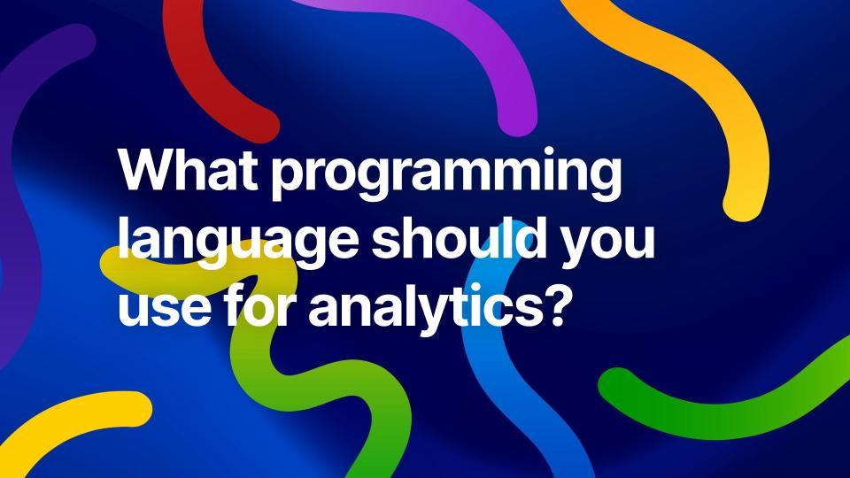

# Introduction to Analytics

Welcome to the world of Data Analytics! In today's data-driven landscape, the ability to analyze and interpret data is crucial for making informed business decisions. This chapter will introduce you to the fundamental concepts of data analytics, its importance in business, and the various types of analytics that organizations use to gain insights from their data.

&nbsp;

## 🔍 What is Data Analytics?

Data Analytics is the process of examining, cleaning, transforming, and modeling data to discover useful information, draw conclusions, and support decision-making. It involves using statistical and computational techniques to analyze large datasets and extract meaningful patterns and trends.

### 💼 Business Analytics

Business Analytics is a subset of data analytics that focuses specifically on analyzing business data to improve decision-making and drive business performance. It encompasses a range of techniques, including descriptive, predictive, and prescriptive analytics, to help organizations understand their operations, customers, and market trends.

| **Aspect**     | **Data Analytics**                                 | **Business Analytics**                                        |
| -------------- | -------------------------------------------------- | ------------------------------------------------------------- |
| **Focus**      | Analyzing data across a wide range of domains      | Applying data analysis specifically to business contexts      |
| **Purpose**    | Identify patterns, trends, and insights from data  | Support better decision-making and improve performance        |
| **Techniques** | Statistical methods, machine learning, data mining | Descriptive, predictive, and prescriptive analytics           |
| **Users**      | Data scientists, researchers, technical analysts   | Business analysts, managers, executives                       |
| **Outcome**    | Deeper understanding and knowledge                 | Actionable strategies and business decisions                  |
| **Examples**   | Healthcare research, social sciences, engineering  | Sales forecasting, marketing campaigns, customer segmentation |

---

## 📈 Types of Analytics

Data analytics can be categorized into four main types:

1. **Descriptive Analytics**: This type of analytics focuses on summarizing historical data to understand what has happened in the past. It uses techniques such as data aggregation and data mining to provide insights into past performance.

2. **Diagnostic Analytics**: Diagnostic analytics goes a step further than descriptive analytics by examining data to determine why something happened. It involves techniques such as drill-down, data discovery, and correlations to identify the root causes of past events.

3. **Predictive Analytics**: Predictive analytics uses statistical models and machine learning algorithms to analyze historical data and make predictions about future events. It helps organizations anticipate trends, customer behavior, and potential risks.

4. **Prescriptive Analytics**: Prescriptive analytics goes a step further by recommending actions based on the insights gained from descriptive and predictive analytics. It uses optimization and simulation techniques to suggest the best course of action for achieving desired outcomes.

In this course, we will primarily **focus on descriptive analytics**, as it forms the foundation for understanding data and making informed decisions.

---

## 💻 Programming Languages for Data Analytics

&nbsp;

When it comes to data analytics, several programming languages are commonly used, each with its own strengths and weaknesses. The choice of programming language often depends on the specific requirements of the project, the expertise of the team, and the tools and libraries available.

| **Language** | **Strengths**                                                                 | **Common Use Cases**                                     | **Best Fit Audience**                    |
| ------------ | ----------------------------------------------------------------------------- | -------------------------------------------------------- | ---------------------------------------- |
| **Python**   | Extensive libraries, easy to learn, strong community support                  | Data manipulation, ML/AI, visualization, scripting       | Beginners, data scientists, AI engineers |
| **R**        | Excellent for statistics, rich visualization packages, strong for exploration | Statistical modeling, hypothesis testing, bioinformatics | Statisticians, researchers, academics    |
| **SQL**      | Efficient for querying, standardized across databases                         | Data retrieval, manipulation, ETL, warehousing           | Database admins, analysts, BI developers |
| **Java**     | High performance, scalable, strong big data ecosystem                         | Large-scale data processing, enterprise systems          | Enterprise engineers, backend developers |

In this course, we will primarily focus on Python and SQL due to their versatility and widespread use in the data analytics field. Python's extensive libraries make it ideal for analytics tasks, while SQL is essential for managing and querying relational databases.

---

## 🔄 Steps in Working with Data (Data Lifecycle)

The data analytics process typically involves the following steps:

1. **Data Collection**: Gathering data from various sources, such as databases, APIs, web scraping, or surveys.
2. **Data Cleaning**: Preparing the data for analysis by handling missing values, removing duplicates, and correcting inconsistencies.
3. **Data Exploration**: Analyzing the data to understand its structure, distribution, and relationships between variables.
4. **Data Modeling**: Applying statistical or machine learning models to the data to uncover patterns and make predictions. For descriptive and diagnostic analytics, this may involve summarizing data and identifying correlations. For predictive analytics, this involves building models to forecast future outcomes. For prescriptive analytics, this includes optimization techniques to recommend actions.
5. **Data Visualization**: Creating visual representations of the data to communicate insights effectively.
6. **Decision Making**: Using the insights gained from the analysis to inform business decisions and strategies.

Data collection is often overlooked, but it is a critical step that can significantly impact the quality of the analysis. Poor data quality can lead to inaccurate insights and misguided decisions. Collecting good data is time-consuming and requires careful planning and execution. This is often the most challenging part of the data analytics process, which may seem counterintuitive to beginners who expect to jump straight into analysis.

Although these steps are presented in a linear fashion, the data analytics process is often iterative. Analysts may need to revisit earlier steps based on findings and insights gained during the analysis.

---

## 📂 Types of Data

Data can be classified into several types based on its structure and format:

| **Type**                 | **Description**                                                   | **Examples**                                       |
| ------------------------ | ----------------------------------------------------------------- | -------------------------------------------------- |
| **Structured Data**      | Organized in a fixed format; easily searchable and analyzable     | Relational databases, spreadsheets                 |
| **Unstructured Data**    | Has no predefined format; more complex to analyze                 | Text documents, images, videos, social media posts |
| **Semi-structured Data** | Combines elements of structured and unstructured data             | JSON, XML, NoSQL databases                         |
| **Time Series Data**     | Data points collected or recorded at specific time intervals      | Stock prices, weather data, sensor readings        |
| **Categorical Data**     | Divides values into distinct categories or groups                 | Gender, product type, customer segments            |
| **Numerical Data**       | Quantitative values that can be measured and expressed in numbers | Age, income, sales figures                         |
| **Text Data**            | Written language data, often unstructured                         | Customer reviews, emails, articles                 |
| **Image Data**           | Visual content analyzed using computer vision techniques          | Photographs, medical scans, satellite images       |
| **Audio Data**           | Sound recordings analyzed for patterns and features               | Music files, speech recordings, podcasts           |
| **Video Data**           | Moving visual media analyzed for content and patterns             | Movies, surveillance footage, video blogs          |

Data types are not rigid silos. Instead, they often intersect and complement each other, depending on how the data is stored and what kind of analysis is being done.

:::{note} Data types often overlap
The categories in the table are useful for understanding data, but in practice data types often overlap. A single dataset can contain multiple types at the same time, or a piece of data might fit into more than one category depending on how it's used.

For example:

**Text + Time Series 📝⏱️**: A stream of customer chat logs over days or weeks is both text data (language) and time series data (timestamps).

**Image + Numerical 🖼️🔢**: A medical scan is an image, but each pixel is stored as numerical values (e.g., grayscale intensities or RGB values).

**Audio + Time Series 🎵⏱️**: Sound recordings are audio data, but technically they are sequences of numerical values over time, making them time series too.

**Categorical + Numerical 📊🔢**: Survey responses like income brackets combine categories (low/medium/high) with underlying numerical ranges.

**Video = Image + Audio + Time Series 🖼️🎵⏰**: Video combines moving images (frame by frame), audio tracks, and timestamps — making it a mix of several types.
:::
