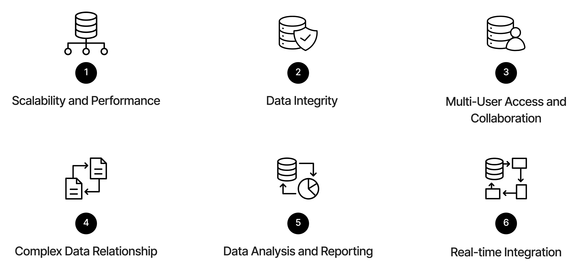

# Introduction to SQL

SQL (**S**tructured **Q**uery **L**anguage) is a powerful language used for interacting with databases. It allows you to perform various operations such as querying data, updating records, and managing database structures.

:::{tip} How do you pronounce SQL? 🗣️

SQL can be pronounced as "sequel" or by saying each letter individually: "S-Q-L" (pronounced "ess-que-el"). Both pronunciations are widely accepted.

:::

Here is an example SQL query that retrieves the total expenses for each account from a hypothetical `journal_entries` table, filtering for entries in the "Expense" account type during the third quarter of 2025, and ordering the results by total expense in descending order:

```sql
SELECT
    account_name,
    ROUND(SUM(amount), 2) AS total_expense
FROM journal_entries
WHERE account_type = 'Expense'
  AND entry_date BETWEEN '2025-07-01' AND '2025-09-30'
GROUP BY account_name
ORDER BY total_expense DESC;
```

| Step                                    | What It Does                           |
| --------------------------------------- | -------------------------------------- |
| `WHERE account_type = 'Expense'`        | Filters only expense accounts          |
| `BETWEEN '2025-07-01' AND '2025-09-30'` | Focuses on one fiscal quarter          |
| `SUM(amount)`                           | Sums all amounts per account           |
| `ROUND(..., 2)`                         | Rounds for presentation                |
| `ORDER BY total_expense DESC`           | Shows largest expense categories first |

---

## 🧩 Different Types of Databases

There are several types of databases, each with its own features and use cases. Some of the most popular databases include:

:::{seealso} Database Management Systems (DBMS)

A Database Management System (DBMS) is software that interacts with end users, applications, and the database itself to capture and analyze data. It provides an interface for users to create, read, update, and delete data in the database.

This chapter will use the term DBMS interchangeably with "database" to refer to the software that manages and interacts with the data. The list of popular databases below refers to different DBMS options available in the market.

:::

### 🧱 Relational Databases (SQL-based) - What we use in this course

**Concept:** Data stored in structured tables with predefined schemas; relationships enforced through keys (primary, foreign).
**Use case:** Transactional systems, financial data, HR systems, enterprise analytics.

**Popular Examples:**

- **[SQLite](https://www.sqlite.org/)**: lightweight, file-based
- **[PostgreSQL](https://www.postgresql.org/)**: open-source, flexible extensions
- **[MySQL](https://www.mysql.com/) / [MariaDB](https://mariadb.org/)**: web applications, e-commerce platforms
- **[Microsoft SQL Server](https://www.microsoft.com/en-us/sql-server/)**: enterprise use (finance, accounting, corporate analytics)
- **[Oracle Database](https://www.oracle.com/database/)**: large enterprise systems, ERP, and legacy corporate environments

:::{note} Relational databases are the most common type of database

In the real world, relational databases are the most widely used type of database. According to the DB-Engines Ranking, relational databases like Oracle Database, MySQL, PostgreSQL, and Microsoft SQL Server consistently rank among the top databases in terms of popularity and usage.

- [DB-Engines Ranking](https://db-engines.com/en/ranking)
- [DB-Engines Ranking by Database Model](https://db-engines.com/en/ranking_categories)

:::

### 🧮 NoSQL (Document) Databases

**Concept:** Schema-less or semi-structured; designed for flexibility, scalability, and unstructured data (text, JSON, IoT, etc.).
**Use case:** Web apps, analytics pipelines, real-time systems.

**Popular Examples:**

- **[MongoDB](https://www.mongodb.com/)**: document-oriented (stores JSON-like documents)
- **[Firebase Firestore](https://firebase.google.com/docs/firestore)**: cloud-based JSON storage for web/mobile apps
- **[Amazon DynamoDB](https://aws.amazon.com/dynamodb/)**: AWS-managed, key-value and document hybrid

### 🔑 Key-Value Stores

**Concept:** Data stored as simple key-value pairs, like a giant dictionary.
**Use case:** Caching, session management, quick lookups, real-time data.

**Popular Examples:**

- **[Redis](https://redis.io/)**: in-memory, extremely fast; often used for caching analytics queries
- **[Memcached](https://memcached.org/)**: simple, in-memory caching layer

### 📊 Columnar Databases

**Concept:** Data stored by **columns** instead of rows, which speeds up aggregation and analytical queries
**Use case:** Business intelligence (BI), OLAP, dashboards, data warehouses.

**Popular Examples:**

- **[Google BigQuery](https://cloud.google.com/bigquery)**: serverless, highly scalable warehouse
- **[Snowflake](https://www.snowflake.com/)**: cloud-native warehouse with data sharing features
- **[DuckDB](https://duckdb.org/)**: local, columnar formats ideal for Python analytics and SQLite-like use

:::{important} Columnar databases are optimized for analytical queries

Columnar databases are designed to efficiently handle read-heavy operations, such as aggregations and complex queries, making them ideal for business intelligence and data warehousing tasks. These tasks are typically called OLAP (Online Analytical Processing). OLAP systems are optimized for querying and reporting rather than transaction processing (OLTP).

OLTP (Online Transaction Processing) systems, on the other hand, are optimized for handling a large number of short online transactions, such as inserting, updating, or deleting records in a database. Row-based relational databases are typically used for OLTP workloads.

Assume you're analyzing 100 million rows of sales data to calculate total revenue by region. A columnar database would read only the relevant columns (e.g., "region" and "sales_amount") instead of scanning entire rows, significantly speeding up the query.

If you want to try out columnar databases locally, [DuckDB](https://duckdb.org/) is a great option. It allows you to work with columnar data formats like Parquet and Arrow directly from your local machine, making it ideal for data analysis tasks in Python without needing a full-fledged database server. [DuckDB](https://duckdb.org/) provides a native Python client, allowing you to run SQL queries on your data seamlessly.

:::

### 🕸️ Graph Databases

**Concept:** Data stored as **nodes (entities)** and **edges (relationships)**; optimized for relationship-heavy data.\
**Use case:** Social networks, fraud detection, recommendation systems.

**Popular Examples:**

- **[Neo4j](https://neo4j.com/)**: most popular open-source graph database
- **[Amazon Neptune](https://aws.amazon.com/neptune/)**: AWS graph database supporting Gremlin and RDF/SPARQL
- **[ArangoDB](https://www.arangodb.com/)**: multi-model (graph + document)

---

## 🛡️ Key Features of Relational Databases

- **Tables**: Data is organized into tables (relations) with rows and columns.
- **Schemas**: Each table has a predefined schema that defines the structure and data types of its columns.
- **Keys**: Primary keys uniquely identify each row, while foreign keys establish relationships between tables.
- **ACID Properties**: Ensure reliable transactions (Atomicity, Consistency, Isolation, Durability).
- **SQL Language**: Standardized language for querying and manipulating data.

---

## 💡 Why Use SQL?



&nbsp;

| **Criteria**                       | **Spreadsheet**                           | **SQL**                                                                            |
| ---------------------------------- | ----------------------------------------- | ---------------------------------------------------------------------------------- |
| 🧮 **Performance**                 | Performance slows as data grows           | Designed to handle massive amounts of data efficiently                             |
| 🧱 **Data Integrity**              | Prone to errors and inconsistencies       | Enforces data integrity through data types, constraints, and relationships         |
| 👥 **Multi-User Access**           | Often limited to single-user access       | Designed for multiple users to access and modify data simultaneously               |
| 🔗 **Complex Data Relationship**   | Struggles with complex relationships      | Excels at representing complex relationships through data models and normalization |
| 📊 **Data Analysis and Reporting** | Offers basic analysis and reporting tools | Powerful data retrieval and analysis using the built-in query language             |
| 🔄 **Real-Time Integration**       | Requires manual data transfer             | Designed for seamless integration                                                  |

---

## 📜 The History of SQL

| **Year**  | **Milestone**                         | **Key Contribution**               |
| --------- | ------------------------------------- | ---------------------------------- |
| **1970**  | Codd's Relational Model               | Foundation of relational databases |
| **1974**  | IBM develops SEQUEL (System R)        | Birth of SQL                       |
| **1979**  | Oracle v2 released                    | First commercial SQL RDBMS         |
| **1986**  | ANSI standardizes SQL                 | SQL becomes official standard      |
| **1995**  | MySQL released                        | Open-source SQL revolution\*       |
| **2000s** | PostgreSQL, SQL Server, Oracle growth | SQL dominates enterprise data      |
| **2010s** | BigQuery, Redshift, Snowflake         | Cloud-based SQL analytics          |
| **2020s** | DuckDB, SQLite, Polars SQL            | Local and embedded analytics SQL   |

\* MySQL was later acquired by Oracle Corporation in 2010, but it remains an open-source project maintained by the community.

#### 1970 - Birth of Relational Databases

Dr. Edgar F. Codd, a computer scientist at IBM, published a groundbreaking paper titled "A Relational Model of Data for Large Shared Data Banks" in 1970. In this paper, Codd introduced the concept of the relational database model, where data is stored in tables (relations) with rows and columns.

#### Early 1970s - SEQUEL Language

In the early 1970s, IBM researchers Donald Chamberlin and Raymond Boyce developed a language called SEQUEL (Structured English Query Language) to manipulate and retrieve data.

#### 1974 - System R Prototype

In 1974, IBM began developing System R, a prototype relational database management system (RDBMS) that implemented the SEQUEL language. SEQUEL was later renamed SQL.

:::{tip} Why do we use SQL instead of SEQUEL?

The name "SEQUEL" was later changed to "SQL" due to trademark issues with an existing company named SEQUEL. Additionally, the acronym SQL (pronounced "S-Q-L") was adopted to better reflect the language's purpose as a structured query language for managing and manipulating relational databases.

:::

#### 1979 - Oracle's Commercial RDBMS

In 1979, Oracle (then known as Relational Software, Inc.) released the first commercially available RDBMS based on SQL. This marked a significant milestone in the adoption of SQL as a standard for database management.

#### 1986 - SQL Standardization

In 1986, the American National Standards Institute (ANSI) adopted SQL as the standard language for relational database management systems. This standardization helped promote the widespread adoption of SQL across different database systems.

:::{note} Learn SQL once, use it everywhere

The standardization of SQL means that once you learn SQL, you can apply your knowledge across various database systems with minimal adjustments. While different RDBMSs may have their own extensions or variations of SQL, the core syntax and concepts remain consistent.

For example, the SQL query you write for PostgreSQL will be very similar to the one you write for MySQL or SQLite, allowing you to transfer your skills easily between different systems.

:::

---

## 💼 Open-Source vs Proprietary Databases

**Open-Source** means that the database software's **source code is freely available**. Anyone can use, modify, and distribute it under a permissive license (e.g., MIT, Apache, GPL).

**Proprietary (Commercial)** means that the database is **owned and licensed** by a company. Users must pay for usage, support, or advanced features. The source code is closed.

| Factor                    | Open-Source                       | Proprietary                                    |
| ------------------------- | --------------------------------- | ---------------------------------------------- |
| **Cost**                  | Free                              | License / subscription required                |
| **Support**               | Community + paid managed options  | Dedicated vendor support                       |
| **Extensibility**         | Highly customizable, plugins      | Controlled extensions                          |
| **Analytics Integration** | Easy with Python, R, and BI tools | Deep integration with Microsoft / Oracle stack |
| **Use in Education**      | ✅ Ideal (lightweight, free)      | ❌ Usually expensive to license                |

### 🧪 Open-Source Software Characteristics

✅ **Advantages:**

- (Usually) Free to use and deploy.
- Huge community support.
- Transparency (you can inspect the engine).
- Runs on many platforms (Linux, macOS, Windows).

:::{caution} Open-source does not always mean free

Some open-source databases offer paid versions with additional features, enterprise support, or managed services. For example, MySQL offers both a community edition (free) and enterprise editions (paid) with advanced features and support.

:::

❌ **Disadvantages:**

- May require more in-house expertise.
- Enterprise-level features (HA, clustering, GUI tools) might need extra setup or third-party add-ons.
- Limited vendor-backed support unless you buy managed versions (e.g., AWS RDS PostgreSQL).

### 📚 Proprietary Software Characteristics

✅ **Advantages:**

- Professional vendor support and SLAs.
- Integrated ecosystems (GUI tools, ETL suites, BI connectors).
- Enterprise-grade reliability, clustering, and security.
- Easier compliance management (SOX, HIPAA, etc.).

❌ **Disadvantages:**

- Licensing cost can be high.
- Vendor lock-in (hard to migrate away).
- Custom extensions may not follow ANSI SQL strictly.

---

## ✅ Key Concepts

### 🗄️ Databases

A database is a structured collection of tables that store related data. A database management system (DBMS) is software that allows you to create, manage, and interact with databases.

### 🧷 Tables (Relations)

A table is a collection of related data organized in rows and columns. Each table has a name and consists of:

- **Rows (Records)**: Each row represents a single entry or record in the table.
- **Columns (Fields)**: Each column represents a specific attribute or field of the data.

### 🧾 Schemas

A schema defines the structure of a table, including the names and data types of its columns. It acts as a blueprint for how data is organized within the table.

### 🔒 Constraints

Constraints are rules applied to table columns to enforce data integrity. Common constraints include:

| Type          | Purpose                                                   |
| ------------- | --------------------------------------------------------- |
| `PRIMARY KEY` | Ensures uniqueness of each row.                           |
| `FOREIGN KEY` | Maintains valid relationships between tables.             |
| `NOT NULL`    | Prevents missing values.                                  |
| `UNIQUE`      | Prevents duplicates in a column.                          |
| `CHECK`       | Enforces valid ranges or conditions (e.g., `amount > 0`). |

### 📇 Indexes

An index is a special data structure that improves the speed of data retrieval operations on a table. It works like an index in a book, allowing the database to quickly locate rows based on the values in indexed columns.

### 🔄 Transactions

A transaction is a sequence of one or more SQL operations that are treated as a single unit of work. The single unit must either be fully completed or fully rolled back to maintain data integrity. Transactions follow the ACID properties:

### 🖼️ Views

A view is a virtual table that is based on the result set of a SQL query. It allows you to simplify complex queries, encapsulate business logic, and provide a layer of abstraction over the underlying tables. Views do not store data themselves; they dynamically retrieve data from the base tables when queried.
